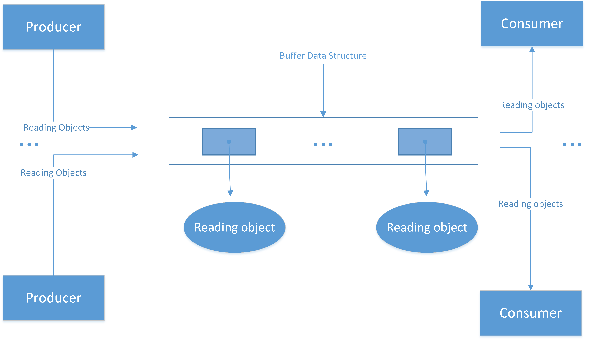

# Activity 2 (Due Sunday Febuary 16 - 4%)

Provide solutions to following problems in the empty files given in this repository. There are numerous "Introduction to Python" tutorials and textbooks available online and via [Seneca's digital library](https://library.senecacollege.ca) which you can reference.

Good coding practices from your previous courses should be used.  The submitted functions should also be annotated with *docstrings* as described [here](https://peps.python.org/pep-0257/).

Use type hints in both solutions and run all programs through a static type checker such as [mypy](https://www.mypy-lang.org). Included in your submission, should be a screen shot of the type checker's results along with a brief explaination of any output generated.

20% of the grade will be dedicated to a discussion with the instructor about your work during the lab session after the due date.

## Learning Objectives

After completing this activity, you should be able to….

- build an application requiring inter-process communication
- implement a program using threads to optimize processing time
- use type hints to statically type check a program

## Late Submissions

Submissions after the due date will be penalized in 10% per day late.  Activities submitted 5 days after the due date will not be accepted and a 0 will be assigned.

## Instructions
 
1. (70 points) Implement a client and web server which manages an inventory of products using Python's `socket` module.

* server process
  * contains a data structure which stores _client user ids_ and _passwords_.  There is no need implement any security features.  For simplicity, the user list can be hardcoded and does not need to be editable.
  * maintains an _inventory of items_.  Each item is uniquely identified by a UPC code (you can simulate this with an integer value).  You should track the current number of units available for each item.  Like the user data structure, the product list should be hardcoded and not editable.  When the system first starts, you can hardcode an initial number available for each item. Functionality to restock items is not required.
  * accepts the following request types from its clients via a socket connection.
    1. accepts user login.  The system should track when users are logged in.  Login occurs when a client submits a user id password pair that is found in the user id data structure 
    2. accept purchase requests. Only logged in users can purchase items. Upon a purchase request, the server responds with a positive acknowldgement message along with the amount purchased and reduces the inventory for that item. Orders that can not be filled are refused and a negative message is included in response.
    3. accepts request to view current inventory. Only logged in users can view inventory. This request should be fulfilled with a response which includes all the items maintained along with the current levels available.
    4. accepts user logout. Any record maintaining the user login information should be deleted.

Inventory levels and login must be persisted to disk during shutdown so that they can be restored upon startup.

* client process
  * provides a text based interface with the following options
    1. user login
    2. view current server inventory
    3. view local inventory
    4. purchase items, (if successful, items are stored in the local inventory)
    5. logout

  * opens socket and sends requests to server (for options that require it).  Responses should be displayed to the user.
  
Local inventory keeps track of what products have been obtained by the user. It must be persisted to a local disk during shutdown so that they can be restored upon startup.

 * you will have to create a simple protocol defining the valid interaction between the processes.  Document this in a separate file.

2. (30 points) In this question, you will create a multithreaded program which has multiple threads accessing a shared resource. You will implement an instance of the [*Producer/Consumer pattern*](https://jenkov.com/tutorials/java-concurrency/producer-consumer.html) where a Producer generates `Reading` objects  subject to the following conditions.

* The shared resource is a list that should store 100 objects. 
* `Producer` objects should generate 2000 `Reading` objects (fields are populated randomly), insert them into the shared resource and then terminate
* `Consumer` objects remove `Reading` objects from the shared resource, pickle the objects and write them to a file. Each `Consumer` object has its own file to write to.  This process should terminate when it must wait for longer than 1 minute to remove an object.
* Synchronization of the shared resource must be implemented by you.  No thread safe data structures are to be used.
* The program should create 7 Producer threads and 3 Consumer threads.
* In order to show that the pickling process works, write a second program which reads pickled objects from a text file and writes them to the console.  It must also report the number of objects successfully read.

